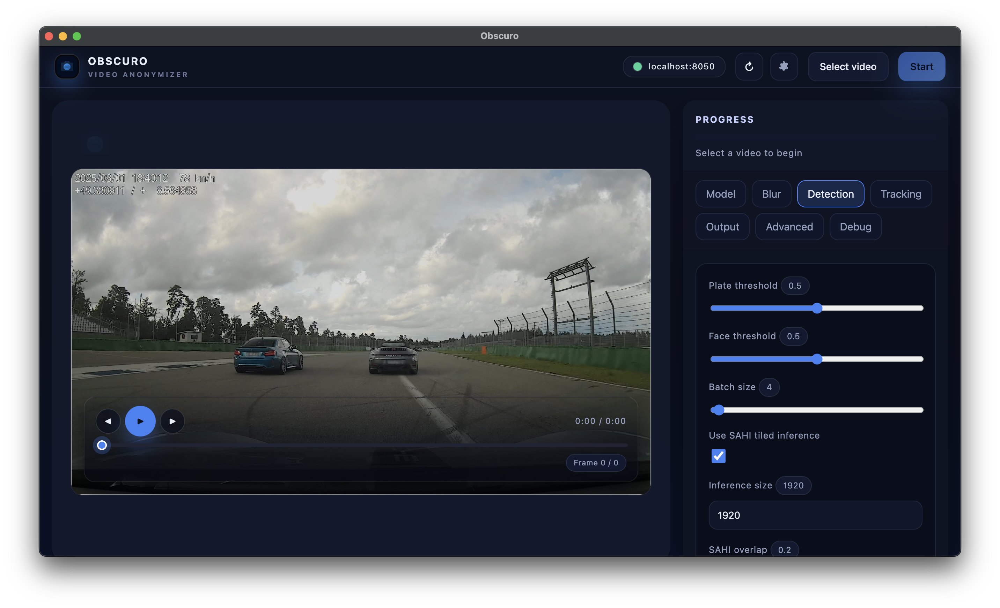

# Obscuro

<p align="center">
  
</p>

Desktop-first tooling for anonymizing dashcam footage: optimized ONNX/SAHI detector pipeline, FastAPI backend, CLI utilities, and an Electron UI with live previews. Trackers include ByteTrack/BotSort plus a fused distance+shape+embedding tracker (with Hybrid SOT built on top for detector gaps). Detection targets are configurable—blur license plates and faces by default, or extend to vehicles, two-wheelers, and pedestrians when using segmentation-enabled models.

## Documentation

- [Overview & architecture](docs/index.md)
- [FastAPI endpoints](docs/api-reference.md)
- [CLI commands](docs/cli-reference.md)
- [Python API guide](docs/python-api.md)
- [Configuration reference](docs/configuration.md)

## Quick start



*Example of the Electron desktop frontend with live video preview and anonymization controls*


```bash
# Create the dev environment (Python 3.12+)
uv sync

# Run the backend API
uv run blur-api

# Launch the Electron desktop frontend (in src/frontend/)
npm install
npm run dev
```

Need CUDA? Only enable the GPU dependencies on NVIDIA-enabled hosts:

```bash
uv sync --extra gpu
```

Container images (CPU and GPU) can be built with `docker build -f Dockerfile[.gpu] .` or consumed from GitHub Container Registry. See the docs linked above for volumes, ports, and auto-start configuration. Visual tracking backends like TrackerNano require user-provided weights (see docs); they are not bundled in the repo.

## Contributing

Open issues and pull requests on [GitHub](https://github.com/tfaehse/obscuro). Run `uv run pytest` and `uv run ruff check` locally before submitting. Artwork and screenshots live under `docs/assets/`.

## License & attribution

Licensed under **AGPL-3.0-or-later**.

- Detector checkpoints are trained from Ultralytics YOLO11 pretrained weights (Ultralytics code is AGPL-3.0: https://github.com/ultralytics/ultralytics/blob/main/LICENSE).
- The MobileNetV3 embedding ONNX (`models/tracking/mobilenetv3_small_embed.onnx`) is exported from `torchvision.models.mobilenet_v3_small` with the classifier stripped (torchvision is BSD-3-Clause: https://github.com/pytorch/vision/blob/main/LICENSE).
- See `LICENSE` and the docs for full attribution guidance.
